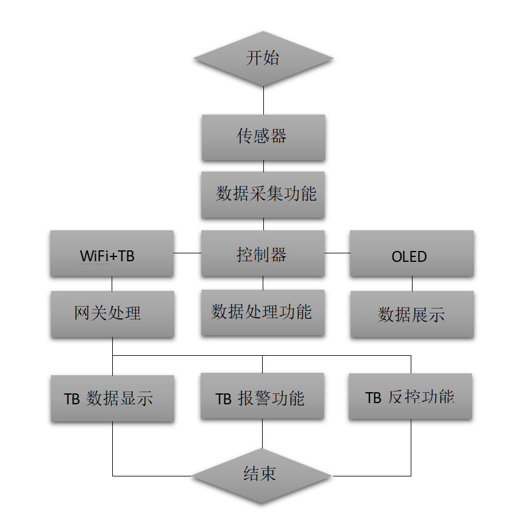
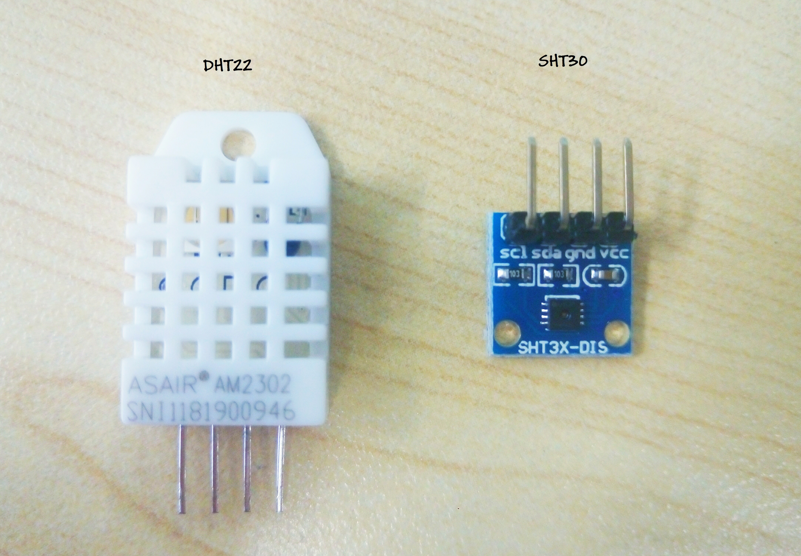
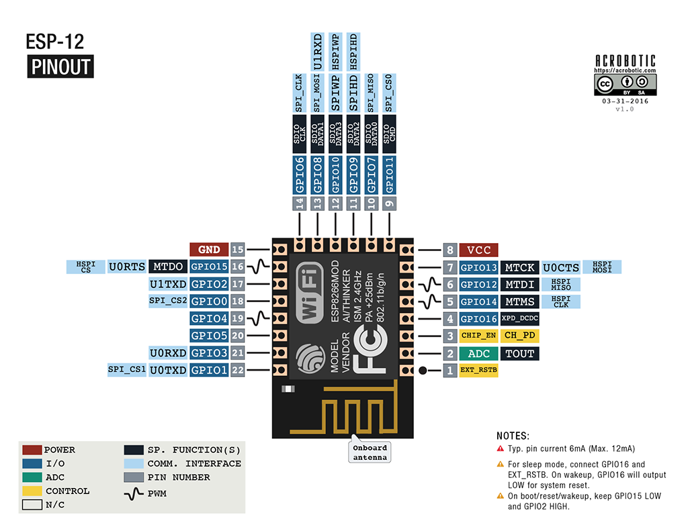
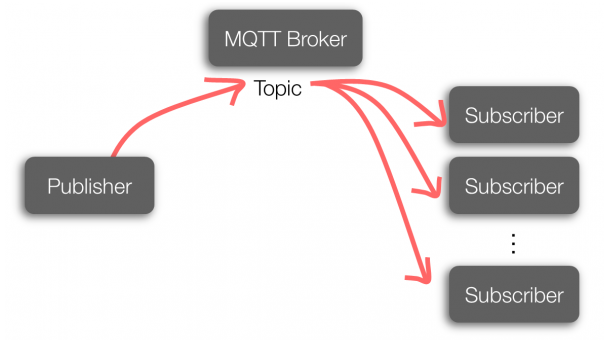
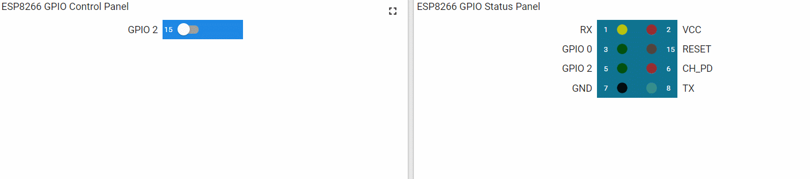
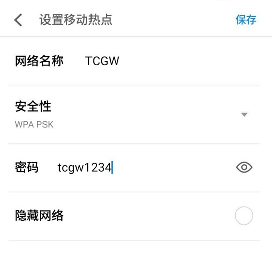
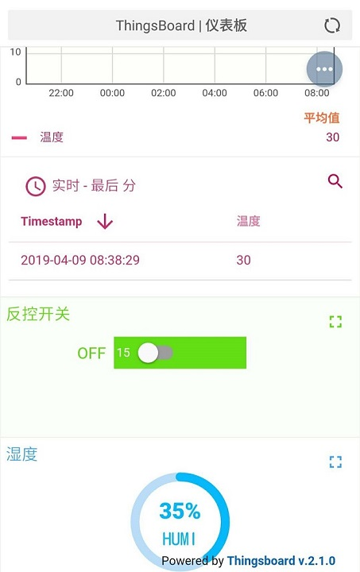

# 空氣質量檢測系統
利用Nodemcu、温湿度传感器以及Thingsboard平台建立的物联网微环境监测系统。


# 目录

* **项目目标**
* **项目技术价值**
* **产品功能简介**
* **产品使用说明**


#  项目目标

## 项目功能

​       本次项目，是依据物联网组成结构，并结合该技术的功能应用而进行的温湿度传感系统的设计:


​        该项目不仅仅是对环境温湿度进行数据监测、显示、传输以及在线反控的平台设备。它还主要围绕了物联网的功能应用，而进行了技术的论证。验证包括物联网结构的采集功能、数据显示功能、数据传输功能、报警功能以及相关的控制功能等，通过轻巧的设备，便能将这些物联网的传统功能全都一一展现。


## 实现意义

​        温湿度是当今品质生活的重要环境指标，它能更准确的展现出气候的变化，与居住环境的舒适度。也因此，温湿度传感设备，已然成为了智能家居系统的最基本成分。而同时，智能家居也是众多物联网技术领域与市场价值的成熟且重要表现，而物联网更是当今科技发展与企业创新力、竞争力的重要标签。

​        所以，本次的温湿度传感项目研究，不仅仅实现了人们对健康且科学生活地实际所需，也通过对物联网领域的技术探索与产品实现，保证了即使面对市场众多客户，亦能通过物联网技术架构与产品功能的清晰展示与生动演示，赢得客户的信任！


# 技术价值

## 市场价值

​        在以往面对市场的概念表述中，时常面临客户众多的技术问题，更加便捷直观的技术体验，往往就是产业技术实力与竞争力的表现。而对物联网市场进行动态分析，并对客观需求进行系统设计与论证，则是最科学、严谨的展示手法。通过与物联网技术的高度融合，并结合该领域的技术优势，进而促进产品的概念创新、科学化设计与产业升级，是提升产业可持续价值的科学手段。这种概念所产生的最直接的市场价值体现，便是有助于我们通过对市场主流技术的研发论证，进而参与并推进市场的开拓，以新颖的展现手法打开我们的销售新渠道。


## 数据支撑价值

​        随着物联网产业的飞速发展，传感技术早已成熟，并初具规模与标准。作为物联网系统的最底层，传感器是新兴技术的展现，更是种价值的标签。它通过其对感知领域信号采集的可靠性、实时性、灵敏性等优势，而深受物联网、大数据和人工智能等技术领域的青睐。这些数据最初经过处理器的信号处理并转换为有效数据后，便可通过网关上传至数据库等相应数据接收端，同时也具有了时间序列。通过这些特性，便可精准的根据数据的实时变化情况而反应出一定时间范围内的发展趋势与变化规律。把握这一系列的数据动态，便是把握了市场动态，抢占市场的潜在价值。而这一切，却也离不开作为最底层的数据采集系统的支撑。


## 技术储备价值

​        企业的发展不同于往，必须学会以严谨的态度融合科技的发展浪潮。物联网技术作为市场开拓与产业升级的新选项，必然少不了对其市场价值的具体分析与参考。而最直接有效的方式，便是通过对项目的具体研发，并对研发过程进行系统的分析，直至有一套完善的项目体系作为标准，无论是在硬件还是软件层面。最后，将这种标准与整体物联网行业的参考标准进行对比，便能有更深入的行业了解。所以，物联网相关项目的设计与实施，可以加深对相关技术领域与市场价值的深度认知，另一方面也可以作为一种技术储备，为以后的项目“创新”提供最基本的技术标准与保障，并以此为基础，提升企业的创新科学理念。


# 功能简介

## 功能结构图




## 具体功能：

### **底层(线下)功能：**

* **数据采集：**

  ​        温湿度作为环境数据监测的最代表性数据，在这里也将以物联网系统的底层数据采集的方式得以体现。它将以一定的采集速率，在不断变更的环境中进行环境感知，其内部的电压、电流将会受此影响，进而产生电信号，并通过一系列的AD转换、滤波、放大等电路处理，并由代码函数进行bit流数据的转换，最终生成有效的环境数据。这是一系列复杂的过程，但是物联网数据采集层完整的过程体现。

  ​        本次项目，采用DHT22(图左)或SHT30(图右)传感器器进行温湿度数据采集，两者精确度差不多。但DHT系列传感器采用的是数字接口，而SHT系列则采用了IIC接口进行传输，所以后者更稳定，同时体积更小、灵敏度也更高；但是前者的成本也更为低廉。

  |        | DHT22（湿度/温度） | SHT30              |
  | ------ | ------------------ | ------------------ |
  | 分辨率 | 0.1%RH/0.1℃        | 0.1%RH/0.1℃        |
  | 精度   | ±2%RH/±0.5℃        | ±3%RH/±0.3℃        |
  | 量程   | 0-100%RH/－40-80℃  | 0-100%RH/－40-125℃ |

  

* **数据显示:**

  ​        数据经过处理后，便可首先通过一些工具包和硬件第一时间进行数据的显示，而无需网关的搭建，显示的硬件面板多种多样，如LED显示阵列、LCD屏、液晶OLED屏、电容TFT屏等待，对应的工具也大有不同。往往在不考虑功耗的情况下，进行数据的展示是具有很大的便利性的，尤其是在无网关或网络环境较差的情况下，也能通过显示的数据进行统计分析，更能实时了解系统的运行状况是否正常。

  ​        项目采用了体积较小的0.96寸OLED显示板，分辨率为128*64。其采用了7pin的SPI传输方式，但是也可以通过后方的电阻改造成IIC传输，这也体现了硬件的灵活性。同时，该oled需要对应的工具包才能实现最终的显示功能，这些工具需要在代码中得到应用，并最终在控制芯片的驱动下执行。如果想要更极致地展现出数据显示界面地丰富度，还需要进行大量的图形化取模设计以及结合更丰富的显示工具，并最终合理地应用于128x64大小地范围。

  

  

* **数据报警**

  ​        物联网系统的正常运行往往需要系统内部的循环监控，而采集的数据同样也需要自动进行阈值的监测预警，与传统的监测相比，这些所必要的预警机制都可以在无人化的环境下实现。

  ​        首先在系统的硬件层面上，通过内部函数的设定，在系统循环运行的同时，进行系统链路下网络环境的状态调试、服务器的连接状态监测、功率的正常检测，并可通过蜂鸣器和警报LED灯实现最终的状态预警机制，以此保障系统运行的正常，为系统的维护提供了便利。

  ​       在排除了网络监测环境的情况下，当被采集的数据出现了异常，或是环境出现了剧烈的变化，已经触碰了预警的水平时，系统内部也能进行基本的数据逻辑判断，并及时响应预警措施。这些都将提升系统整体的稳定性，也保证了物联网系统的适应能力。

* **自动控制**

  ​       自动控制系统，也属于物联网硬件系统的一部分，常用于物联网系统的预警机制等。它主要通过功率不等的继电器、光耦继电器、三极管等，根据电信号的变化而进行开关的闭合，而电信号的变化往往又由控制器内部对传感数据以及链路状态的实时监测进行决定的，一旦状态或数据异常，便给予电平变化响应开关，进而关闭或打开用电器电源。而物联网对自动化的运用，并不单单是对电平的控制，还包括对模拟信号的控制，它能给予0-1024间模拟值的设置，来控制功率大小，比如自动巡航无人机的电机控制等，都需要经过内部传感的数据感知和逻辑判断，并使用电调等模块进行即时且具体的速率控制，这是一套复杂的系统，却也增加了物联网系统的应用范围。


### 网关处理：

​       本次项目，采用的是易鑫2.4G的ESP8266系列WiFi控制芯片，它的便捷之处便是在于实现WiFi功能的同时，也能通过内部封装集成的Tensilica超低功耗微型MCU进行信号的采集、监测与转换。ESP8266模块包含了多种版本，Nodemcu则采用了12f版本。其支持标准的IEEE802.11 b/g/n协议，具有完整的TCP/IP协议栈。

​       



​       对该模块的选用，不仅更大程度保证了低成本、低功耗、小型化等特点，也以更为便捷的方式保证了网关的稳定运行。WiFi模块与物联网TB平台的对接，则采用了目前主流的MQTT协议。它支持发布、预定的传输模式，具有很小的通信开销，并且在不稳定的网络环境提供了三种不同的消息传输等级以适应该环境下的正常传输，而且功耗很低。这同样最大限度地以较低的成本保证了网关的正常连接。




### **平台(线上)功能：**

* **数据显示**

  ​       在具有良好且稳定的网络环境下，通过与物联网平台的结合，可以更大程度地完善物联网系统的功能。最基本的，便是数据通过网关对接至物联网平台后的展示功能。而本次使用的是Thingsboard平台，这是一个开源且功能丰富的平台。它可以自由的设计拼接仪表面板，仅需一个创建一个设备TOKEN，便可以将数据轻松的展现于模块化的仪表面板上。

  

* **线上报警：**

  ​        在对线上数据进行实时监测的同时，当数据超出正常范围是，便可以通过对规则链的设置以及规则链下的节点创建，来进行预警机制的设置，他将根据节点的中代码逻辑判断的提前设置，便可轻松创建警报。当然，对于使用者来说，报警的界面随着开发的轻巧配置也变得更加简洁易懂，而与此同时，该平台还具有发送预警邮件的功能，更大程度地让用户第一时间获取数据地异常状况。这也是该平台的优势之一，也为数据的预警提供了更多的便利与可能。

* **线上控制**

  ​        对于用户来说，一个完整的物联网系统，尤其是物联网平台，仅仅具有预警功能是远远不够的。没有及时的相应措施，预警功能形同虚设。所以该平台还提供了便捷的控制面板模块，仅需简单的状态点击，便可轻易的进行远程开关的控制，最大限度地提高了应急措施的响应速度，这对用户来说无疑是高效的。而它的原理也很简单，当用户按下按钮的瞬间，平台便可在MQTT协议下自动通过设备TOKEN向远端控制器发布报文，继而控制引脚的电平，实现开关的远程控制。本次项目，将通过一个绿色OLED进行反控的实现与演示。

  

# 項目實施

## 實施準備

- 硬件成分：Nodemcu*1、DHT22*1、0.97'Oled*1;
- 软件成分：Arduino IDE及相关库文件；

**项目开始前，在软件和硬件上，都需要做出必要的改变，正确的搭建环境可以确保实验的顺利进行**

1. 硬件上，此次项目将会对0.96'Oled进行改造，该屏为7pin的SPI传输方式，可通过一定方式改成IIC传输：将屏幕后的R3通过焊接移至R1，再将R8短接即可。
2. 开始进行硬件的连线，具体连接方式参见下图：
3. 此项目中屏幕的显示，主要通过"Adafruit_SSD1306.h"进行实现,而该函数库也支持SPI传输，所以可以不进行IIC的改造；但是，OLED为128x64，而该库函数默认值为128x32，所以需要打开"Adafruit_SSD1306.h"，找到注释行"#define SSD1306_128x64_i2c",取消该行的注释，并将"#define SSD1306_128_32"注释，保存即可；：
4. 此次的项目控制器，采用了Nodemcu，所以编译器安装后，由于无法找到对应端口的开发板设备，程序并不能直接烧入，所以需要进行第三方开发板库的安装，具体安装方式可参见链接：[https://blog.csdn.net/u013810296/article/details/54862447?utm_source=blogxgwz3]；

## 寫入程序

1. 按图连接好线路，确保电路的稳定连接，否则会因电压的不稳定导致采集数据的不稳定；

2. 将控制器连接至电脑，在配置好环境的前提下选择:

3. 更改热点等部分参数后，开始进行烧写，当下方出现橙色进度“.........100%”时，表示烧写成功。若有错误提示，检查线路是否连接正常，并重新插拔端口；

4. 打开TB端设备，观察数据是否成功连接并传输：

   _*补充：_

   1. _有些128x64的显示器无法进行显示，第一先检测该显示器的默认传输方式是什么，"Adafruit_SSD1306.h"库可实现SPI、IIC两种连接方式，具体实现方式可参见库文件内“example”中的代码案列；第二请确定该显示模块的地址为多少，常用地址为：0x3C、0x3D,在主程序中的如下语句中修改：_

   	```
    display.begin(SSD1306_SWITCHCAPVCC, 0x3D); 
    ```

   2. _如果需要进行显示界面的更改，再更改时的取模设置，最好设置为：横向取模、保留最后一位逗号并在字母前加0；_

   3. _项目中的IIC引脚及RST引脚都采用了软定义，尽量不再使用默认的IIC引脚，即：GPIO4、GPIO5;_


# 使用说明

**本次项目，通过逐步的完善后，变得更易于掌握与使用：**

1. 首先，将该设备连接数据线，（普通的安卓数据线）即可：

   

2. 在上电成功后，小巧的oled便会进行配网提示，只需要利用手机开启热点，该设备便可自动进行连接，然后便可进行数据的采集检测与传输了。（在配置的过程中，请按屏幕的要求配置SSID与热点密码）：

   

   

3. 每个设备背后，都会对应一个二维码，通过浏览器或其它应用可直接对其进行扫描，而后便可自动跳转至物联网数据监测平台，通过该面板的按钮，便可实现数据的监测和LED的远程控制了：

   